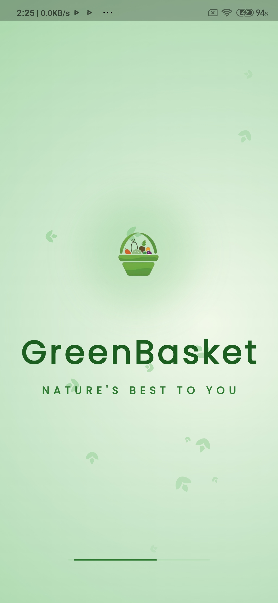
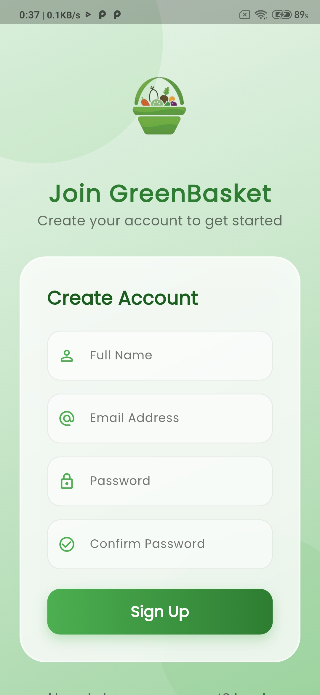
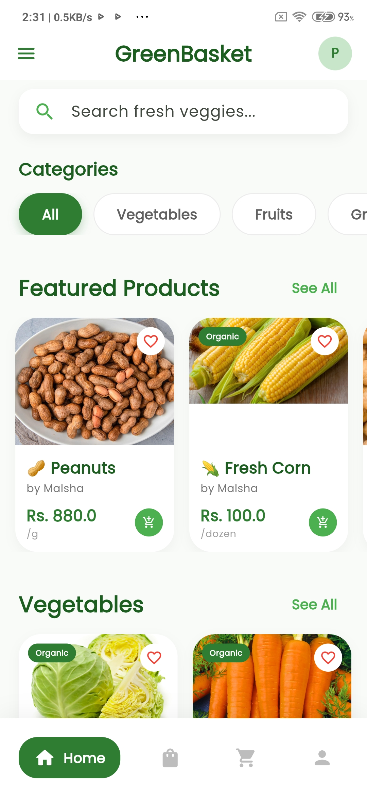
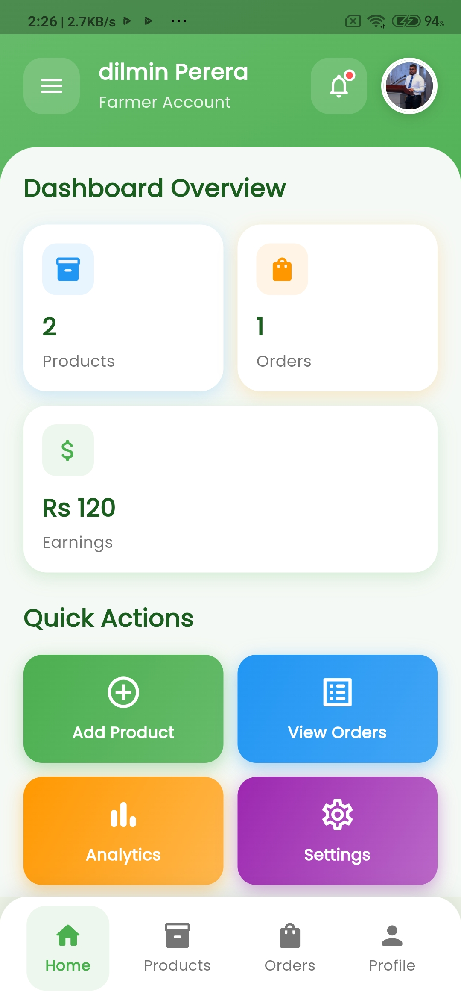
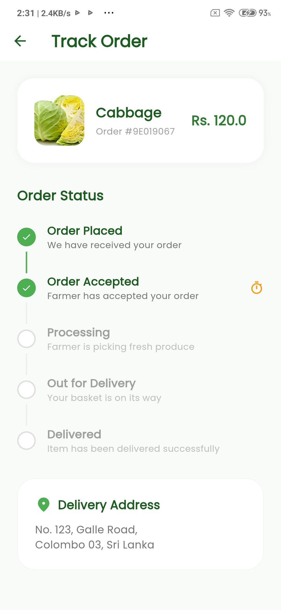

# 🌿 GreenBasket

**GreenBasket** is a premium, full-stack mobile application built with **Flutter** and **Supabase**, designed to bridge the gap between local farmers and health-conscious buyers. It provides a direct-to-consumer marketplace for fresh, organic, and locally-grown produce.

---

## 📸 visual Demonstration

| Splash Screen | Create Account | Buyer Homepage |
| :---: | :---: | :---: |
|  |  |  |

| Farmer Dashboard | Track Order |
| :---: | :---: |
|  |  |

---

## ✨ Key Features

### 🛒 Buyer Experience
- **Smart Product Discovery**: Browse products by categories (Vegetables, Fruits, Grains, etc.) with real-time search functionality.
- **Personalized Wishlist & Cart**: Dedicated local storage (scoped per user) for managing favorite items and shopping carts.
- **Secure Checkout**: Seamless order placement process with various payment simulation screens.
- **Real-time Order Tracking**: Stay updated on the status of your fresh produce deliveries.

### 👨‍🌾 Farmer Experience
- **Advanced Analytics**: Detailed sales reports, revenue trends (6-month bar charts), and top-selling product insights.
- **Product Management**: Easily add, edit, and delete products with high-quality image uploads.
- **Real-time Activity Feed**: Instant notifications for new orders and inventory updates.
- **Custom Profile**: Manage farm details and personal information.

### 🔐 Security & Auth
- **Role-based Redirection**: Intelligent routing based on user role (Buyer vs. Farmer).
- **Supabase Authentication**: Secure signup and login with email/password and profile synchronization.
- **Data Isolation**: Each user's cart and wishlist are private and securely stored.

---

## 🛠️ Technology Stack

- **UI Framework**: [Flutter](https://flutter.dev/) (3.x)
- **Backend Service**: [Supabase](https://supabase.com/) (Auth, Real-time Database, Storage)
- **Local Storage**: [Shared Preferences](https://pub.dev/packages/shared_preferences)
- **Typography**: [Google Fonts (Poppins)](https://fonts.google.com/specimen/Poppins)
- **Icons**: Material Design Icons
- **Formatting**: `intl` package for currency and dates

---

## 🚀 Getting Started

### Prerequisites
- Flutter SDK (Latest Stable)
- Android Studio / VS Code
- A Supabase Project

### Installation

1. **Clone the repository**:
   ```bash
   git clone https://github.com/dilminekanayaka/GreenBasket-mobileApp-flutter-supabase.git
   ```

2. **Navigate to the directory**:
   ```bash
   cd greenbasket
   ```

3. **Install dependencies**:
   ```bash
   flutter pub get
   ```

4. **Environment Setup**:
   Ensure your Supabase URL and Anon Key are correctly set up in `lib/main.dart`:
   ```dart
   await Supabase.initialize(
     url: 'YOUR_SUPABASE_URL',
     anonKey: 'YOUR_SUPABASE_ANON_KEY',
   );
   ```

5. **Run the App**:
   ```bash
   flutter run
   ```

---

## 🤝 Contributing

Contributions are welcome! Feel free to open issues or submit pull requests to help make **GreenBasket** even better.

## 📄 License

This project is licensed under the MIT License - see the [LICENSE](LICENSE) file for details.

---

Developed with ❤️ by **[Dilmin Ekanayake]**
